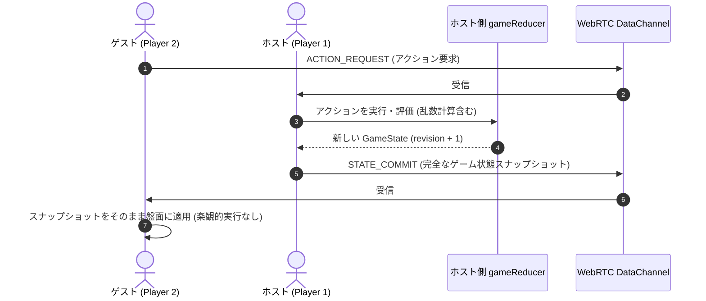

# UNION ARENA Simulator - 開発者・管理者向け仕様書 (Developer Guide)

本ドキュメントは、**UNION ARENA Simulator** のアーキテクチャ、状態管理、P2P同期プロトコル、データパイプライン、および保守・運用手順について解説する技術仕様書です。

---

## 目次

1. [技術スタック](#1-技術スタック)
2. [ディレクトリ構造と責務](#2-ディレクトリ構造と責務)
3. [ドメイン状態管理アーキテクチャ](#3-ドメイン状態管理アーキテクチャ)
   - [単一情報源 (Single Source of Truth)](#単一情報源-single-source-of-truth)
   - [Immer による不変状態遷移](#immer-による不変状態遷移)
   - [カード保存則の不変条件 (Conservation Law)](#カード保存則の不変条件-conservation-law)
4. [P2P通信アーキテクチャ (Host-Authoritative)](#4-p2p通信アーキテクチャ-host-authoritative)
   - [ホスト権威型同期モデル](#ホスト権威型同期モデル)
   - [メッセージプロトコルとリビジョン管理](#メッセージプロトコルとリビジョン管理)
   - [秘匿情報 (Hidden Information) の扱い](#秘匿情報-hidden-information-の扱い)
5. [カードデータパイプライン](#5-カードデータパイプライン)
   - [公式カードデータ構造](#公式カードデータ構造)
   - [スクレイピングと同期スクリプト (`npm run sync-cards`)](#スクレイピングと同期スクリプト-npm-run-sync-cards)
6. [開発ワークフローとテスト戦略](#6-開発ワークフローとテスト戦略)
   - [テスト駆動開発 (TDD) 原則](#テスト駆動開発-tdd-原則)
   - [テストレイヤーと所有権 (Test Ownership)](#テストレイヤーと所有権-test-ownership)
   - [完了チェックリスト](#完了チェックリスト)
7. [デプロイと運用環境](#7-デプロイと運用環境)
   - [Vercel 静的ホスティング](#vercel-静的ホスティング)
   - [WebRTC / PeerJS Cloud 設定](#webrtc--peerjs-cloud-設定)

---

## 1. 技術スタック

| 分類 | 技術 | バージョン / 詳細 |
|---|---|---|
| **フロントエンド** | React | `^18.3.1` (Hooks, Functional Components) |
| **言語** | TypeScript | `~5.6.2` (Strict Mode) |
| **スタイリング** | Tailwind CSS | `^3.4.1` (ユーティリティファースト, カスタムスクロールバー) |
| **状態管理** | Immer | `^10.1.1` (`produce` による不変ドメインリデューサー) |
| **P2P通信** | PeerJS | `^1.5.4` (WebRTC DataChannel 抽象化) |
| **ルーティング** | React Router | `^6.26.2` |
| **テストフレームワーク** | Vitest | `^4.1.11` (jsdom, Testing Library) |
| **ビルドツール** | Vite | `^6.4.3` (ESBuild, Rollup) |
| **アイコン** | Lucide React | `^0.441.0` |

---

## 2. ディレクトリ構造と責務

```
src/
├── components/                 # UIコンポーネント群
│   ├── board/                  # ゲーム盤面関連
│   │   ├── Board.tsx           # 盤面メインコーディネーター (キーボード・DnD・モーダル統合)
│   │   ├── FieldZone.tsx       # フロント / エナジーライン枠 (スロット・BP・発生エナジー)
│   │   ├── CardView.tsx        # カード単体描画 (レスト回転, バッジ, DnDドラッガブル)
│   │   ├── SideZonesArea.tsx   # ライフ, 山札, AP, 場外, 除外エリア
│   │   ├── HandArea.tsx        # 手札エリア
│   │   ├── AttackLineOverlay.tsx # アタック宣言時のSVGポインター線
│   │   └── RevealedCardModal.tsx # トリガーチェック / カード拡大詳細モーダル
│   ├── controls/               # 操作バー・ツールバー
│   │   ├── PhaseBar.tsx        # 公式5フェイズ進行バー & 「次のフェイズ ▶」ボタン
│   │   ├── ActionToolbar.tsx   # プレイ補助ツールバー (ドロー, 全アクティブ, AP回復, Undo, 画面フィット)
│   │   └── PreGameBar.tsx      # 試合前準備バー (デッキ選択, マリガン, ライフ配置)
│   ├── deckBuilder/            # デッキ構築画面コンポーネント
│   └── modals/                 # 各種専用ポップアップモーダル
│       ├── LifeSelectModal.tsx # ライフ一覧・任意指定・トリガーチェックモーダル
│       ├── LifeReorderModal.tsx# ライフ並び替えモーダル (サー・ナイトアイ等)
│       ├── TopDeckModal.tsx    # 山札上N枚確認・各ゾーン振り分けモーダル
│       ├── CardSearchModal.tsx # 山札全体検索モーダル
│       ├── UnderCardsModal.tsx # レイド下敷き・裏向きマーカー確認モーダル
│       ├── RaidOrMarkerModal.tsx # レイド登場 / マーカー配置選択モーダル
│       ├── DeckPlacementModal.tsx# 山札ドロップ時の上/下配置モーダル
│       ├── OpponentHandModal.tsx # 相手手札公開・指定ハンデスモーダル
│       └── ...
├── domain/                     # 純粋ドメインロジック (ビジネスルール)
│   ├── reducer.ts              # ゲーム状態遷移の単一情報源 (gameReducer)
│   ├── deckValidation.ts       # デッキ50枚・タイトル・トリガー制限バリデーション
│   ├── peerSync.ts             # P2Pホスト権威型同期・リビジョン・パケット処理
│   ├── initialState.ts         # ゲーム初期状態生成関数
│   └── __tests__/              # ドメイン単体テスト (Vitest)
├── hooks/                      # カスタムフック
│   ├── useGame.ts              # ゲーム状態管理 (ローカルリデューサー, Undoスタック)
│   └── usePeer.ts              # WebRTC PeerJS接続・メッセージ送受信ハンドラ
├── types/                      # 型定義
│   ├── card.ts                 # Card, CardColor, CardType, TriggerType
│   ├── game.ts                 # GameState, PlayerState, Phase, CardLocation
│   ├── actions.ts              # GameAction (全操作のアクション型定義)
│   └── peer.ts                 # PeerMessage (P2P通信パケット型定義)
├── data/                       # 静的マスターデータ
│   ├── officialCards.json      # 公式全カードDB (8,559枚)
│   └── officialSeriesData.ts   # 作品タイトル一覧マスター
└── utils/                      # 共通ユーティリティ (音声再生, デッキストレージ)
```

---

## 3. ドメイン状態管理アーキテクチャ

### 単一情報源 (Single Source of Truth)
本シミュレーターのゲーム状態は `src/domain/reducer.ts` 内の `gameReducer` が唯一の状態遷移責任を持ちます。
UIコンポーネントが状態を直接ミューテーション（書き換え）することは固く禁止されており、必ず `src/types/actions.ts` で定義された `GameAction` を `dispatchAction` 経由で発行します。

### Immer による不変状態遷移
`gameReducer` は Immer の `produce` を用いて実装されています：
```typescript
export const gameReducer = (state: GameState, action: GameAction): GameState => {
  return produce(state, (draft) => {
    switch (action.type) {
      case 'MOVE_CARD': {
        // draft に対する直感的なミューテーション記述
        // Immer が完全な不変（Immutable）新しい状態オブジェクトを生成
        break;
      }
      // ...
    }
  });
};
```

### カード保存則の不変条件 (Conservation Law)
ゲーム中のカード総数は、ルール上明示的に生成・消去されるアクションを除き、**ゾーン間移動前後で常に保存されなければなりません**。
- 不正な操作（空きスロットがない移動、存在しないカードID等）は、部分的な削除を行わず**安全な No-Op（何もしない）**として処理されます。
- 例: イベントカード（`cardType === 'EVENT'`）がフィールドへ移動された場合、スロットを汚染せず自動的に `graveyard`（場外）へルーティングされます。

---

## 4. P2P通信アーキテクチャ (Host-Authoritative)

### ホスト権威型同期モデル
本リポジトリでは、シャドウバースエボルヴ等の実装に倣い、**ホストが唯一の真実を決定する「ホスト権威型（Host-Authoritative）」同期** を厳格に採用しています。



1. **ゲストは楽観的実行を行わない**:
   - ゲストがカード操作やドローを行っても、ローカルで reducer は実行されません。
   - `ACTION_REQUEST` メッセージとしてホストへ送信されます。
2. **ホストがすべての乱数・決定論的評価を実行**:
   - 山札シャッフル、初期手札配布、ダイスロール、ランダム手札破棄などはホストが1回のみ計算します。
   - ゲスト側で乱数を再計算することによる「両者の状態のズレ（Desync）」は原理的に発生しません。
3. **リビジョン管理**:
   - コミットごとに `revision` 番号が単調増加します。重複パケットや古いリビジョンのコミットは破棄されます。
4. **Undo（巻き戻し）の同期**:
   - ゲストからのUndo要求もホスト側のヒストリースタックに対して適用され、巻き戻された最新状態が `STATE_COMMIT` として再配信されます。

### メッセージプロトコルとリビジョン管理
`src/types/peer.ts`:
- `ACTION_REQUEST`: ゲスト ➔ ホスト。実行要求。
- `STATE_COMMIT`: ホスト ➔ ゲスト。確定盤面スナップショット（`revision`, `gameState`）。
- `SYNC_REQUEST` / `SYNC_RESPONSE`: 再接続時・初期合流時のフル同期。
- `CHAT_MESSAGE`: チャットメッセージの交換。

### 秘匿情報 (Hidden Information) の扱い
- 現在のモデルは P2P 相互信頼モデル（Trusted Peers）を採用しており、`GameState` は両 peer に完全なデータとして同期されます。
- UI層（`HandArea`, `SideZonesArea`, `Board`）において、相手の手札、裏向きのライフ、山札の内部配列は自動的にマスキング（裏向き表示・カード名不可視）されます。
- ※意図しないUI導線で相手の非公開情報を閲覧できるようにする変更は禁止されています。

---

## 5. カードデータパイプライン

### 公式カードデータ構造
全カード情報は `src/data/officialCards.json` に約8,559枚分が静的JSONとして保持されています。
```typescript
export interface Card {
  id: string;             // インスタンス一意ID (例: c-1726880000000-1)
  code: string;           // カードナンバー (例: UA01BT/CGH-1-001)
  name: string;           // カード名
  cardType: CardType;     // 'CHARACTER' | 'EVENT' | 'FIELD'
  color: CardColor;       // 'PURPLE' | 'RED' | 'BLUE' | 'YELLOW' | 'GREEN' | 'COLORLESS'
  bp?: number;            // 基礎BP (キャラのみ)
  apCost: number;         // 必要AP
  reqEnergy: number;      // 必要エナジー
  genEnergy: number;      // 発生エナジー
  traits: string[];       // 特徴 (例: ["アッシュフォード学園", "生徒会"])
  triggers: TriggerType[];// トリガー (例: ["DRAW", "RAID"])
  effectText: string;     // 公式効果テキスト
  imageUrl?: string;      // 公式高解像度画像URL (Bandai CDN)
  // ゲーム進行用拡張プロパティ
  isRested: boolean;
  bpModifier: number;
  underCards: Card[];
  isFaceDown?: boolean;
}
```

### スクレイピングと同期スクリプト (`npm run sync-cards`)
カードデータの更新は手動で行わず、提供されているバッチスクリプトを使用します：
```bash
npm run sync-cards
```
- `scripts/sync-official-cards.js`: バンダイ公式サイトのカード検索一覧ページを順次フェッチし、HTMLパーサー（`src/services/officialCardService.ts`）でパースして正規化されたJSONを出力します。
- ※ユニットテストは外部ネットワークに依存しないよう、ローカルの静的フィクスチャを用いてテストされます。

### BANDAI TCG+ API 連携 (`src/services/bandaiTcgPlusService.ts`)
BANDAI TCG+ のデッキコード／レシピURLから直接50枚デッキを構築するサービスです：
- **2段階解決**:
  1. `GET https://api.bandai-tcg-plus.com/api/user/deck/url_code?deck_code={code}` -> `url_code`, `game_title_id: 9`
  2. `GET https://api.bandai-tcg-plus.com/api/user/deck/recipe?url_code={url_code}&game_title_id=9&encode=0&app_version=9.9.9` -> `main_deck`（カード番号・枚数・属性）
- **プロキシ**: 開発環境は `vite.config.ts` の `/api/tcg-plus` リバースプロキシを経由し、静的ホスティング時は外部プロキシ（`allorigins`）にフォールバック。
- **カード照合**: プール内のカード番号末尾一致で既存カードに紐付け。未登録新弾カードはAPIレスポンスのメタデータから自動フォールバック生成。

---

## 6. 開発ワークフローとテスト戦略

### テスト駆動開発 (TDD) 原則
本リポジトリでは `AGENTS.md` に従い、**TDD（Red -> Green -> Refactor）を標準** とします。
1. 仕様変更・バグ修正の際、まずその挙動を表明する**最小のテストを先に作成**する。
2. テストが意図通りの理由で失敗（Red）することを確認する。
3. 最小限の実装変更を行い、テストを成功（Green）させる。
4. リファクタリングを行い、全テスト・リント・ビルドの通過を確認する。

### テストレイヤーと所有権 (Test Ownership)

| 変更内容 | 主な所有テストファイル | テスト種別 |
|---|---|---|
| **Reducer 状態遷移・ルール** | `src/domain/__tests__/reducer.test.ts` | 純粋単体テスト |
| **P2P同期・リビジョン・ホスト権威** | `src/domain/__tests__/peerSync.test.ts` | 同期整合性テスト |
| **デッキバリデーション (50枚/制限)** | `src/domain/__tests__/deckValidation.test.ts` | ルール単体テスト |
| **公式カードHTMLパース** | `src/services/__tests__/officialCardService.test.ts` | フィクスチャテスト |
| **BANDAI TCG+ レシピ連携** | `src/services/__tests__/bandaiTcgPlusService.test.ts` | APIパース・照合テスト |
| **公式インポート・TCG+モーダル** | `src/components/deck/OfficialImportModal.test.tsx` | コンポーネントテスト |
| **盤面カード描画・操作** | `src/components/board/CardView.test.tsx` | コンポーネントテスト |
| **フェイズ進行・ショートカット** | `src/components/controls/PhaseBar.test.tsx` | コンポーネントテスト |
| **ライフ選択モーダル** | `src/components/modals/LifeSelectModal.test.tsx` | コンポーネントテスト |
| **公開・詳細モーダル** | `src/components/board/RevealedCardModal.test.tsx` | コンポーネントテスト |
| **試合前フロー (PreGameBar)** | `src/components/controls/PreGameBar.test.tsx` | コンポーネントテスト |

### 完了チェックリスト
すべてのPR・機能追加・バグ修正は以下のコマンドをすべて通過して完了とします：
```bash
npm test              # 全テストスイート (Vitest)
npm run lint          # ESLint (警告・エラー 0 件)
npm run build         # TypeScript 型チェック + Vite プロダクションビルド
git diff --check      # 空白・インデント・構文異常チェック
```

---

## 7. デプロイと運用環境

### Vercel 静的ホスティング
本プロジェクトは静的シングルページアプリケーション（SPA）としてビルドされ、Vercel にデプロイ可能です。
- `vercel.json`:
  ```json
  {
    "rewrites": [{ "source": "/(.*)", "destination": "/index.html" }]
  }
  ```
- クライアントルーティング（`/`, `/game`, `/deck-builder`）を `index.html` にルーティングする設定が含まれています。

### WebRTC / PeerJS Cloud 設定
- デフォルトでは PeerJS 公式の無料シグナリングサーバー（`0.peerjs.com`）を使用します。
- 通信確立後はブラウザ間で P2P Direct DataChannel が開通するため、サーバー負荷はほとんど発生しません。
- 企業内ネットワークや特定のNAT環境でP2P接続が阻害される場合は、STUN/TURNサーバーを `usePeer.ts` の Peer 設定に追加することで回避可能です。
