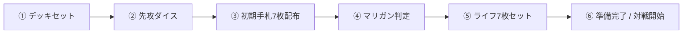

# UNION ARENA Simulator - プレイヤー操作マニュアル (User Guide)

本ドキュメントは、**UNION ARENA Simulator** を使用して一人回し（ソロプレイ）やP2Pオンライン通信対戦を行うプレイヤーのための操作ガイドです。

---

## 目次

1. [対戦モード](#1-対戦モード)
   - [一人回し (ソロプレイ)](#一人回し-ソロプレイ)
   - [P2P通信対戦 (オンライン対戦)](#p2p通信対戦-オンライン対戦)
2. [対戦前準備 (Pre-Game フロー)](#2-対戦前準備-pre-game-フロー)
   - [デッキ選択](#デッキ選択)
   - [先攻・後攻の決定](#先攻後攻の決定)
   - [マリガン (引き直し / キープ)](#マリガン-引き直し--キープ)
   - [ライフ配置と対戦開始](#ライフ配置と対戦開始)
3. [ゲーム盤面の構造と見方](#3-ゲーム盤面の構造と見方)
   - [フロントライン (Front Line)](#フロントライン-front-line)
   - [エナジーライン (Energy Line)](#エナジーライン-energy-line)
   - [サイドゾーン (Side Zones)](#サイドゾーン-side-zones)
   - [手札エリア (Hand Area)](#手札エリア-hand-area)
4. [カードの基本操作](#4-カードの基本操作)
   - [登場と配置 (キャラ / イベント)](#登場と配置-キャラ--イベント)
   - [レイド登場とマーカー配置](#レイド登場とマーカー配置)
   - [レスト / アクティブの切り替え](#レスト--アクティブの切り替え)
   - [カード詳細・拡大確認](#カード詳細拡大確認)
   - [ゾーン間移動](#ゾーン間移動)
5. [ターンの進行とフェイズ](#5-ターンの進行とフェイズ)
   - [公式5フェイズの流れ](#公式5フェイズの流れ)
   - [フェイズの進め方と「次のフェイズ ▶」ボタン](#フェイズの進め方と次のフェイズ--ボタン)
   - [ターン終了時自動アクティブ化](#ターン終了時自動アクティブ化)
6. [アタックとバトル解決](#6-アタックとバトル解決)
   - [プレイヤーへのアタックとトリガーチェック](#プレイヤーへのアタックとトリガーチェック)
   - [キャラへのアタック (バトル解決)](#キャラへのアタック-バトル解決)
7. [ライフ・山札・APの特殊操作](#7-ライフ山札apの特殊操作)
   - [ライフ任意選択モーダル](#ライフ任意選択モーダル)
   - [山札の確認・サーチ・下から操作](#山札の確認サーチ下から操作)
   - [AP操作とエクストラドロー](#ap操作とエクストラドロー)
8. [キーボードショートカット & 便利機能](#8-キーボードショートカット--便利機能)
   - [ショートカット一覧](#ショートカット一覧)
   - [画面フィット (スクロール不要) モード](#画面フィット-スクロール不要-モード)
   - [操作の取り消し (Undo)](#操作の取り消し-undo)
9. [デッキビルダーの使い方](#9-デッキビルダーの使い方)

---

## 1. 対戦モード

### 一人回し (ソロプレイ)
トップページの「**一人回しを始める**」をクリックすると起動します。
- **反転なし固定視点**: 下側が Player 1、上側が Player 2 で固定され、画面が突然180度回転することはありません。
- **両手札の直接操作**: Player 1・Player 2 双方の手札が常時表向きで表示され、どちらのカードも直接ドラッグ＆ドロップやクリックでプレイできます。
- **手札の秘匿トグル**: 相手手札エリアにある `[🔒 隠す]` / `[👁️ 開く]` ボタンで、一人回しのブラインド練習も可能です。

### P2P通信対戦 (オンライン対戦)
WebRTC（PeerJS）を利用したサーバーレスのブラウザ間直接通信対戦です。ログインやアカウント登録は不要です。
1. **ホスト (部屋作成)**:
   - トップページの「**P2P部屋を作成（Host）**」をクリック。
   - 発行された「招待URL」または「ルームID」をコピーして対戦相手に送付します。
2. **ゲスト (部屋参加)**:
   - 受け取った招待URLをブラウザで開くか、トップページの「**部屋に参加（Guest）**」にルームIDを入力して合流します。
3. **同期とプライバシー**:
   - ゲームの全判定はホストが権威を持って管理（Host-Authoritative）するため、シャッフルやダイスが完全に同期します。
   - 相手の手札や裏向きライフ、山札の中身は対戦相手の画面では自動的に伏せられます。

---

## 2. 対戦前準備 (Pre-Game フロー)

対戦開始前、画面中央に **試合前準備バー (PreGameBar)** が表示されます。公式ルール通りの手順で進行します。



1. **デッキ選択**:
   - `[デッキ選択]` ボタンを押して、保存済みデッキやプリセットデッキ（コードギアス、呪術廻戦、HUNTER×HUNTER等）をセットします。
2. **先攻・後攻の決定**:
   - `[🎲 先攻ダイス]` を振るか、先攻プレイヤーを直接指定します。
3. **初期手札の受取とマリガン**:
   - 山札から自動で7枚の手札が配られます。
   - 手札を確認し、`[🔄 引き直し (マリガン)]`（山札に戻してシャッフルし7枚引き直す）または `[✅ キープ]` を選択します。
4. **ライフ配置**:
   - マリガン決定後、`[🛡️ ライフ7枚を配置]` ボタンを押して、山札の上から7枚をライフエリアに裏向きでセットします。
5. **対戦開始**:
   - 両者が `[準備完了]` になると、`[⚔️ 対戦開始]` ボタンが有効化され、第1ターン（先攻プレイヤーのターン）が始まります。

---

## 3. ゲーム盤面の構造と見方

```
┌─────────────────────────────────────────────────────────────┐
│ [ツールバー: デッキ選択 / 1枚ドロー / 全アクティブ / AP回復 / 画面フィット] │
├─────────────────────────────────────────────────────────────┤
│ 【Player 2 (上側)】                                          │
│  [サイドゾーン: ライフ・山札・場外・除外・AP]  [手札エリア]    │
│                                           [エナジーライン]  │
│                                           [フロントライン]  │
├─────────────────────────────────────────────────────────────┤
│ 【中央フェイズバー: TURN 1 / Player 1手番 / 各フェイズ / 次へ ▶】│
├─────────────────────────────────────────────────────────────┤
│ 【Player 1 (下側)】                                          │
│                                           [フロントライン]  │
│                                           [エナジーライン]  │
│  [手札エリア]    [サイドゾーン: ライフ・山札・場外・除外・AP]  │
└─────────────────────────────────────────────────────────────┘
```

### フロントライン (Front Line)
- 最大4枠の戦闘エリアです。
- アタックや相手キャラのブロックを行います。
- 各カードの **BP**（戦闘力）、**BP補正値**（`+1000` など）が表示されます。

### エナジーライン (Energy Line)
- 最大4枠のリソース発生エリアです。
- ここに置かれたアクティブ状態のキャラから発生エナジー（紫1、赤2など）が自動集計され、ライン上部にリアルタイム表示されます。
- アタックはできませんが、移動フェイズでフロントラインへ進出させることができます。

### サイドゾーン (Side Zones)
- **ライフ (Life)**: 初期7枚。ダメージを受けるとここからトリガーチェックまたは場外へ送られます。
- **山札 (Deck)**: 残り枚数表示。1枚引く、シャッフル、上を見る、下から操作などのメニューを完備。
- **APエリア**: 現在の残りAP / 最大AP。
- **場外 (Graveyard)**: 退場したキャラや使用済みイベントカードの置き場。クリックで全一覧・回収可能。
- **除外 (Removed)**: ゲームから除外されたカードの置き場。

---

## 4. カードの基本操作

### 登場と配置 (キャラ / イベント)
- **手札からの登場**:
  - 手札のカードをクリックすると選択状態（青枠）になります。
  - 配置したいフロントラインまたはエナジーラインの空きスロットをクリックすると登場します（ドラッグ＆ドロップでも配置可能）。
  - 公式ルール（Ver 1.1）に基づき、**登場したキャラは自動的にレスト状態（横向き）**になります。
- **イベントカードの使用**:
  - イベントカードはフィールドに出ず、使用すると直接「場外」へ置かれます。
  - 手札からスロットへのクリックやドラッグ、または右クリックメニューの **「⚡ イベントを使用（場外へ）」** を選択すると、即座に場外へ送られバトルログに使用が記録されます。

### レイド登場とマーカー配置
既存のカードが存在する枠に手札のカードを重ねようとすると、専用の **レイド・マーカー選択モーダル** が自動的にポップアップします。
- **⚔️ 【レイド登場】フロントラインへ移動して登場**:
  - エナジーラインにいるキャラをフロントラインの空き枠へ移動させながらレイドします。
  - レイドしたカードは、元のカードがレスト状態であっても**アクティブ状態で登場**します。
- **⚡ 【レイド登場】エナジーラインにとどまる / フロントラインに重ねて登場**:
  - その枠で重ねてレイド登場します。
- **🛡️ 【マーカー配置】裏向きで下に置く**:
  - カード効果等で裏向きマーカーとして下敷きに追加します。
  - コントローラー（持ち主）はいつでも左上の `MARK` バッジをクリックして、裏向きマーカーのカード内容を確認できます。

### レスト / アクティブの切り替え
右クリックメニューを開く必要はありません：
- **ダブルクリック**: フィールド上のカードをダブルクリックするだけで、瞬時にレスト（横向き）/ アクティブ（縦向き）がトグルします。
- **回転アイコンボタン**: カードの右上に表示される回転アイコンをクリックすることでも即座に切り替え可能です。
- **全アクティブ**: ツールバーの `[全アクティブ]` を押すと自陣の全カードが一括でアクティブになります。

### カード詳細・拡大確認
- **ダブルクリック**: 手札や場外などのカードをダブルクリックすると詳細モーダルが開きます。
- **🔍 ズームアイコン**: カード右上の虫眼鏡アイコンをクリック。
- **キーワード効果のカラーハイライト**: 【登場時】(紫)、【退場時】(赤)、【アタック時】(黄)、【レイド】(赤紫) などの重要キーワードがカラーバッジで視覚的に強調されます。
- **フルスクリーン画像拡大**: 詳細モーダル内のカード画像をクリックすると、画面いっぱいの高解像度拡大表示になります。

### ゾーン間移動
- カードの右クリックメニューから「手札へ戻す」「場外へ送る」「除外する」「山札の上へ」「山札の下へ」「ライフへ」など、あらゆる領域への移動が自由に行えます。
- ドラッグ＆ドロップで山札へ落とした際は、「山札の上」か「山札の下」かを選ぶモーダルが表示されます。

---

## 5. ターンの進行とフェイズ

### 公式5フェイズの流れ

| フェイズ | 公式ルール・自動処理内容 |
|---|---|
| **1. スタート** | 前ターンのカード・APが全回復（リロール）。山札から1枚自動ドロー（先攻第1ターンを除く）。1APを支払って追加で1枚引く「エクストラドロー」が可能。 |
| **2. 移動** | エナジーラインのキャラ1枚をフロントラインの空き枠へ（またはその逆へ）移動可能。 |
| **3. メイン** | キャラやイベントのプレイ、アクションポイントの消費、効果の発動。 |
| **4. アタック** | フロントラインのキャラによる攻撃宣言（※先攻第1ターンはアタック不可）。 |
| **5. エンド** | ターン終了時。**自陣の全カードが自動的にアクティブ状態に戻ります**。 |

### フェイズの進め方と「次のフェイズ ▶」ボタン
画面中央のフェイズバー右側にある **「次のフェイズ ▶」** ボタンを押すだけで、迷わず順番通りに進行できます：
- `START` ➔ **「移動フェイズへ ▶」**
- `MOVE` ➔ **「メインフェイズへ ▶」**
- `MAIN` ➔ **「アタックフェイズへ ▶」**（先攻第1ターンは自動でエンドへスキップ）
- `ATTACK` ➔ **「エンドフェイズへ ▶」**
- `END` ➔ **「ターン終了 ➔」**（ボタンがアンバー色に発光・パルスします）

### ターン終了時自動アクティブ化
公式ルール P13 に準拠し、**エンドフェイズボタンを押し忘れて直接「ターン終了」ボタンを押した場合でも、ターンを終えるプレイヤーの全カード・APが自動的にアクティブ化**されます。

---

## 6. アタックとバトル解決

### プレイヤーへのアタックとトリガーチェック
1. アタックしたいフロントラインのキャラをクリックし、**「⚔️ プレイヤーにアタック」** を選択します（アタックラインが伸びます）。
2. 相手プレイヤーの盤面エリアまたはライフをクリックします。
3. アタッカーが自動的にレストになり、バトルログに宣言が出力されます。
4. 防御側はライフからカードを引き、**トリガーチェック**（中央に公開モーダルが表示）を行います。
5. トリガー解決後、モーダルの `[場外へ送る (基本)]`（ゲットトリガー時は `[手札に加える]`）を押して解決します。

### キャラへのアタック (バトル解決)
1. アタッカーの右クリックから **「⚔️ 相手キャラにアタック」** を選ぶか、アタック宣言後に相手のフロントラインのキャラをクリックします。
2. アタッカーが自動でレストになります。
3. **BPが自動比較判定**されます：
   - アタッカーBP $\ge$ 防御キャラBP ➔ アタッカー勝利。防御キャラは自動的に場外へ送られます。
   - アタッカーBP $<$ 防御キャラBP ➔ 防御側勝利。防御キャラはフィールドに残ります。
4. バトルログに詳細な勝敗とBP結果が出力されます。

---

## 7. ライフ・山札・APの特殊操作

### ライフ任意選択モーダル
ライフの横にある **「🎯 選択」** ボタン、またはライフ枚数をクリックすると、全ライフカードが一覧表示される専用モーダルが開きます。
- **相手ライフに対して**:
  - `[⚡ このライフでトリガーチェック]`: 任意のライフを指定してトリガーチェック。
  - `[💥 直接場外へ送る (-1ダメ)]`: インパクトやダメージ2の直接ダメージ。
  - `[🔄 表/裏 切替]`: 眞霜平助などの公開効果用。
- **自分ライフに対して**:
  - `[⚡ トリガーチェック]` / `[✋ 手札に回収]` / `[🗑️ 場外へ]` / `[⬆️ 山札の上へ]` / `[⬇️ 山札の下へ]`

### 山札の確認・サーチ・下から操作
- **上からN枚確認**: 山札メニューの `[上を見る]` から1〜5枚を選択。専用モーダルで手札・場外・山札上下・ライフ・フィールドへ直感的に振り分け。
- **山札の一番下から (ガメラ、VF-0D等)**:
  - `[一番下を確認]`: 自分のみ手元でカード内容を確認。
  - `[一番下を公開]`: 相手の画面にもカード詳細を公開。
  - `[一番下を場外へ]`: ボトムカードを直接場外へ墓地送り。
  - `[一番下を手札へ]`: ボトムカードを直接手札へ回収。
- **山札全体サーチ**: `[探す]` ボタンからカード名や効果テキストで検索し、手札や各ゾーンへ直接ピックアップ。

---

## 8. キーボードショートカット & 便利機能

### ショートカット一覧

| キー | 動作 |
|---|---|
| **`Space`** | **次のフェイズへ進む**（エンドフェイズ時はターン終了） |
| **`Escape`** | **カード選択解除** / **アタックターゲット指定キャンセル** / **モーダルを閉じる** |
| **`Ctrl + Z`** / **`Cmd + Z`** | **操作の取り消し (Undo)**（直前の操作を1手巻き戻す） |

※チャット欄や検索窓に文字を入力している最中は、誤動作防止のためショートカットが無効化されます。

### 画面フィット (スクロール不要) モード
ツールバーの **`[🖥️ 画面フィット]`** ボタンで切り替えます。
- **画面フィット (推奨)**: ブラウザの高さ（100vh）に合わせてカードやスロットのサイズが自動調整され、**縦スクロールバーが一切発生せず盤面全体を見渡せます**。
- **拡大表示**: カードを大きく見たい場合のスクロール表示モードです。設定はブラウザに自動保存されます。

### 操作の取り消し (Undo)
ツールバーの `[Undo]` ボタンまたは `Ctrl+Z` で、間違えて移動したカードやドローを安全に1手前の状態に巻き戻せます。

---

## 9. デッキビルダーの使い方

ヘッダーの `[デッキビルダー]` から利用できます。
1. **カードライブラリ検索**: 全8,500枚以上の公式カードからタイトル、色、特徴、AP、エナジー、BP、トリガーで絞り込み。
2. **50枚公式ルールの自動バリデーション**:
   - デッキ合計50枚チェック
   - 同一カード名・カードナンバー4枚制限（パラレル版自動合算）
   - トリガー枚数上限（SPECIALトリガー最大4枚、FINALトリガー最大4枚など）
   - 同一作品タイトルコード縛り判定
3. **BANDAI TCG+ デッキレシピ / コード直接インポート**:
   - 公式アプリやWEBで共有されたデッキレシピURL（例: `https://www.bandai-tcg-plus.com/deck_code_recipe/...`）またはデッキコードを入力するだけで、**50枚のカード構成（枚数・画像含む）を一発で読み込み、シミュレータ上に再現**します。
   - カードプールに未収録の新弾カードが含まれている場合でも、APIから画像やカードデータを自動補完してそのまま使用可能です。
4. **インポート / エクスポート & 公式シリーズ一括取得**:
   - 作成したデッキをJSON形式で保存・読み込み可能。他の端末や友達との共有もワンクリックで行えます。
   - 公式サイトから商品ごとのカードリスト（通常版／パラレル版）をオンライン取得してカードプールを拡張することも可能です。
